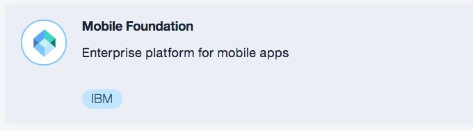

# SmartFollowup

The SmartFollowup is an intuitive example usage of [Bluemix Push Notifications Service](https://console.ng.bluemix.net/docs/services/mobilepush/index.html?pos=2) with the help of [Watson Tone Analyzer Service](http://www.ibm.com/smarterplanet/us/en/ibmwatson/developercloud/tone-analyzer.html) , [OpenWhisk](https://developer.ibm.com/open/openwhisk/) and [Cloudant Service](https://cloudant.com/).

The SmartFollowup app will register a feedback on the recently purchased items to the cloudant `complaints` database. The OpenWhisk will read changes in the `complaints` and will send data to Watson Tone Analyzer. The Tone Analyzer will send back the results to OpenWhisk. By analyzing the results, OpenWhisk will fetch appropriate message from Cloudant `moods` database and construct a valid message. This message gets pushed to `IBM Push Notifications service`, and is delivered to the mobile device.

##Requirements

* iOS 10
* Xcode 8.+
* Swift 3.+
* Cocoapods


### Setup Bluemix and Cloudant.

Complete the steps:

 Go to https://console.ng.bluemix.net and Log in. Click on [Catalog](https://console.ng.bluemix.net/catalog/) on the top bar.

1. On the left pane click on `Boiler Plates` below Apps.  Create [MobileFirst service starter] app. This will have `Push notification service`.

   

2. Create an `Mobile Foundation` service.

   

3. Click on [Catalog](https://console.ng.bluemix.net/catalog/) on the top bar. On the left pane click on `Watson` below `Services`.Create  a `Watson Tone Analyzer` Service.

    

4. Create a database named `mood` in your [Cloudant](https://cloudant.com/). In the `mood` database, create a view named `new_view` and design named `moodPick`.

5. Click the new design document you have created in step 3 and update it with the following lines. Do not have to change the `_id` and `_rev` values.

```
{
  "_id": "_design/moodPick",
  "_rev": "XXXXXXXXXXXXXXXXXXXXXXXXXXXXX",
  "indexes": {
    "fields": {
      "analyzer": "keyword",
      "index": "function(doc) {index("default", doc._id, {"facet": true});if ((doc.mood) || (doc.mood===0)){index("doc.mood", doc.mood);}if ((doc.message) || (doc.message===0)){index("message", doc.message);}}"
    }
  },
  "views": {
    "new_view": {
      "map": "function (doc) { emit(doc.mood,doc.message);}"
    }
  },
  "language": "javascript"
}

```

6. To the updated new design document, add messages for each emotions - `Fear, Sadness, Disgust, Anger and Joy` (Watson Tone Analyzer outputs). For example,

```
{
"mood": "Joy",
"message": "thank you very much for your valuable feedback. We are extremely happy to here from you. Come back again have a wonderfull shopping experience with us."
}
```

7. In your Cloudant, create one more database named `complaints`. This will be used in iOS application

## Configure Push service

 Go to your push service and add `iOS` configuration. Please follow the doc [here](https://github.com/ibm-bluemix-omnichannel-iclabs/NewsSeconds#create-apns-certificate) to create iOS certificates

## Setup the OpenWhisk.

The `BlueShoping.swift` file need the following parameters to complete the actions.

- `appId` - Bluemix app GUID.

- `appSecret` - Bluemix Push Notification service appSecret.

- `version` - This is the version of the [Tone Analyzer service](https://watson-api-explorer.mybluemix.net/apis/tone-analyzer-v3#/) .

- `cloudantUserName` - Your Cloudant username. This is for accessing your `mood` database in Cloudant.

- `cloudantPermissionKey` - Your Cloudant cloudantPermission Key. This is for accessing your `mood` database in Cloudant.

- `cloudantPermissionPassword` - Your Cloudant cloudantPermission Password. This is for accessing your `mood` database in Cloudant.

1. Open the OpenWhisk Web Editor, and create `swift` action. Replace the content of the action with `BlueShoping.swift`
2. Create a Cloudant package binding using the [Bluemix OpenWhisk CLI](https://new-console.ng.bluemix.net/openwhisk/cli).

  ```
    wsk -v package bind /whisk.system/cloudant CloudantPackage -p username 'cloudantUsername' -p password 'cloudantPassword'
    -p host 'yourUserName.cloudant.com' -p dbname 'complaints'
  ```

3. Create a OpenWhisk `Trigger`.

  ```
  wsk trigger create yourTriggerName --feed /yourNameSpace/CloudantPackage/changes
  ```

4. Create a rule to connect your action (step 1) and trigger (step 3)

  ```
  wsk rule create myRule yourTriggerName yourActionName
  ```

5. Open the SmartFollowup app in `XCode.app`. Go to the `AppDelegate.swift` file and add values for ,

  ```
  //cloudant
  var cloudantName:String = "Cloudant DB name"
  var cloudantUserName:String = "Cloudant Username"
  var cloudantPassword:String = "Cloudant password"
  var cloudantHostName:String = "Your cloudant host name"

  //Whisk
  var whiskKey:String = "OpenWhisk Key"
  var whiskPass:String = "OpenWhisk password"

  //Push Service
  var pushAppGUID:String = "push Service app GUID"
  var pushAppClientSecret:String = "push Service client secret"
  var pushAppRegion:String = "Push/AppID service region"

  //APPID
  let appIdTenantId = "your APPID tenant Id"
  ```

6. Do `pod install` in the application. And open `SmartFollowup.xcworkspace`

7. Run the application and Login using AppID.

8. Go to the feedback page and send feedback.

9. You will get push notifications as feedback response.


### License

Copyright 2017-2018 IBM Corporation

Licensed under the [Apache License, Version 2.0 (the "License")](http://www.apache.org/licenses/LICENSE-2.0.html).

Unless required by applicable law or agreed to in writing, software distributed under the license is distributed on an "as is" basis, without warranties or conditions of any kind, either express or implied. See the license for the specific language governing permissions and limitations under the license.
